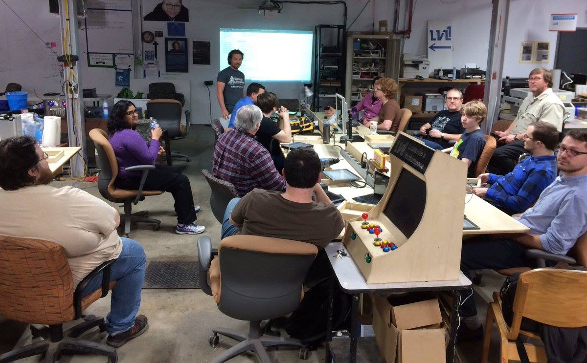
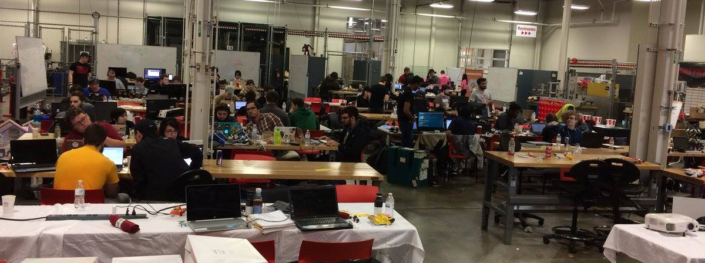

Update: 2/27/17

[LouTrail](https://devpost.com/software/loutrail target=_blank), won the "Home is Where the Hack is" catergory! I was happy to be a part of the team, going forward I wish the team the best in deploying finally version; I probably wont be on team with future deployments, but its not necessarily something you need or have to do.  It was a great event.  I will do it again.

derbyhacks.io was a success, I enjoyed it tremedously.  If you ever have a chance to experience such an atmosphere you should give it a try.  I actually slept at the event, they had a quiet place to put your sleeping bag and had extra bean bags you could lay on.I stayed from friday to sunday - end of event. Food from derbyhacks sponsors was awesome.  very organized event and just fun.  Mayor came by and I actually got to speak to him, shook his hand while one of our other team mate explained the LouTrail project we were doing.

I will be attending [Dery Hack Live](http://derbyhacks.io/live.html).

[photos](https://photos.google.com/share/AF1QipNsF5UjfgII4YsK4YBDqZ7uIZ9ae7wMotQxlxbWVlQ1wSoSCTxQi55CwjMrcVugmA?key=LUl4YVFMOU5aZ1RKZlR4LVJYWF9CNzhXZ0NOYkp3 target=_blank)  Photos from...
